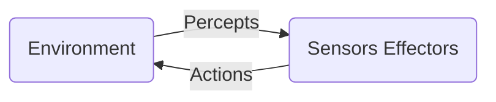

# Agents

## Agent

- An agent can be naything that perceive its environment through sensors and act upon that environment through actuators
- An agent runs in the cycle of perceiving, thinking, and acting
- To understand the structure of intelligent agents, we should be familiar with architecture and agent program
- `Agent = Architecture + Agent Program`

## Architecture

- Architecture is the machinery that the agent executes on. It is a device with sensors and actuators, for example: a robotic car, a camera, a PC.

## Agent Program

- Agent program is the implementation of agent function

## Agent Function

- Agent function is a map from the percept sequence to an action

## When is an agent program considered intelligent?

- An agent program is an intelligent agent program if it follows the weak notion (i.e., flexibility, interactivity, and autonomy) and strong notion (i.e., information-related states, connotative states and affective states)

## Intelligent Agent

- An intelligent agent is an autonomous entity which acts upon an environment using sensors and actuators for achieving goals.
- An intelligent agent may learn from the environment to achieve their goals

