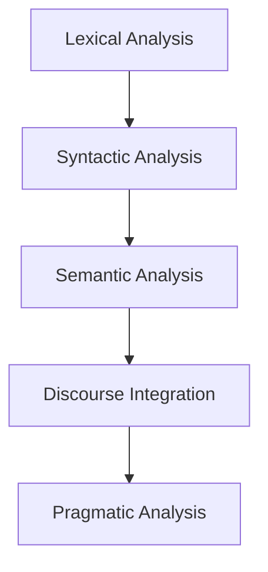

# Natural Language Processing (NLP)

## What is Natural Language Processing (NLP)?

- Natural Language Processing (NLP)

## Role

## Five Phases in NLP

### Lexical analysis

Involves identifying and anlyzing the structure of words. Lexical analysis is dividing the whole chunk of text into paragraphs, sentences and words.

### Syntactic analysis (Parsing)

It involves analysis of words in the sentence for grammar and arranging words in a manner that shows the relationship among the words.

### Semantic analysis

It draws the exact meaning or the dictionary meaning from the text. The text is checked for meaningfullness. It is done by mapping asyntactic structures and objects in the task domain.

### Discourse integration

The meaning of any sentence depends upon the meaning of the sentence just before it. In addition, it also brings about the meaning of the sentence that follows it.

### Pragmatic analysis

During pragmatic analysis, what was said is re-interpreted on what it actually meant. It involves deriving those aspects of language which require real world knowledge.

