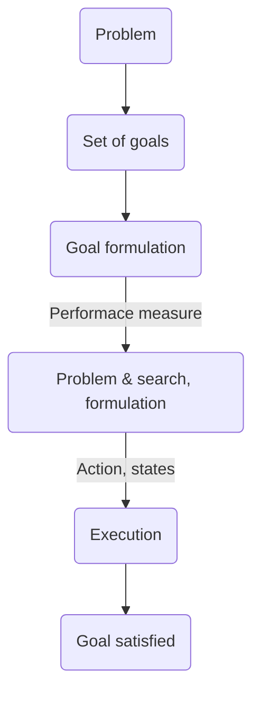

# Problem Solving Approaches

## AI Components required to solve problem

There are six major componnents of an artificial intelligence system. They are solely responsible for generating desired results for particular problem. These components are as follows

### Knowledge Representation

Used for representing necessary knowledge so as to generate knowledge base with the help of which AI system can perform tasks and generate results

### Heuristic Searching Techniques

While dealing with the problems the knowledge base keeps on growing and growing making it difficult to search in that knowledge base. To tackle this challenge, heuristic searching techniques can be used which can provide results efficiently in terms of time and meory usage

### Artificial Intelligence Hardware

Hardware must be efficient to accommodate and produce desired results. Hardware components include each and every machinery required spanning from memory to processor to communicating devices

### Computer Vision & Pattern Recognition

AI programs capture the inputs on their own by generating a real world scenario with the help of this component. Sufficient and compatible hardware enables better patterns gathering that makes a useful knowledgebase

### Natural Language Processing

This component processes or analysis written or spoken languages. Acquiring the word squence and parsing sentence into computer is not just sufficient to gain knowledge about environment for AI systems. Natural Language processing plays vital role in understanding of domain of text to AI

### Artificial Intelligence Language & Support Tools

Artificial intelligence languages are almost similar to traditional software development programming languages with additional feature to capture human brain processes and logic as much as possible

## Formal Description of the problem

### ⁠Explicit goal of the problem

Goals help to organize behaviour of systems by limiting the objectives that the agent is trying to achieve. Goal formulation is based on the current situation and the agent's performance measure. It is first step towards problem solving.

### Implicit criteria for succes

That is how success is defined. That will be the ultimate thing system needs to achieve, which is the problem solution's output.

### Initial situation

It means that what is going to be the start state of problem being solved.

### Ability to perform

It tells how agents transform from one situation to another, how operations and rules are specified which change the states of the problem during solution process.

## Two main kinds of problem formulation

### ⁠Incremental formulation

- It involves operators that augment the state description, starting
with an empty state.
- It generates many sequences.
- Menmory requirements is less as all states are not explored
(exploration will be done till the goal is found).

### ⁠Complete state formulation

- In this initially we will have some basic configuration represented
in initial state.
- Here while doing any action first the conditions on the actions will
be checked so that the configuration state after the action will be
same legal state.
- It takes up large memory as complete state space is generated. This
formulation reduces number of sequences generated.

## Steps in Problem Solving Agent

Problem solving agent achieves success by taking following approach to problem solution

### 1. Goal Setting

Agent set the goal by considering the environment

### 2. Goal Formulation

The goals set in step 1 are formalized in the framework. The key activity in goal formulation is:

- To observe current state
- To tabulate agent's performance measures

### 3. Problem Formulation

- After formulating goal, it is required to find out what will be the sequence of actions which generate goal state
- Problem formulation is a way of looking at actions and states generated because of actions, which leads to success

### 4. Search in unknown environment

- If the task environment is unknowne then agent first tries different sequence of actinos and gathers knowledge (i.e., learning). Tehn agent gets known set of actions which leads to goal state. Thus agent search for describable sequence of actions this processs is called as searching process
- With knowledge of environment and goal state we can design a search algorithm. A search algorithm is a procedure which takes problem as input and returns its solution which is represented in the form of action sequence

### 5. Execution Phase

- Once the solution is given by the search algorithm then the actions suggested by the algorithm are executed
- This is the execution phase. Solution guides agent for doing the actions. After executing the actions, agent again formulate new goal.

