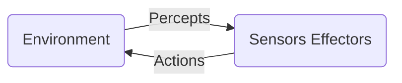
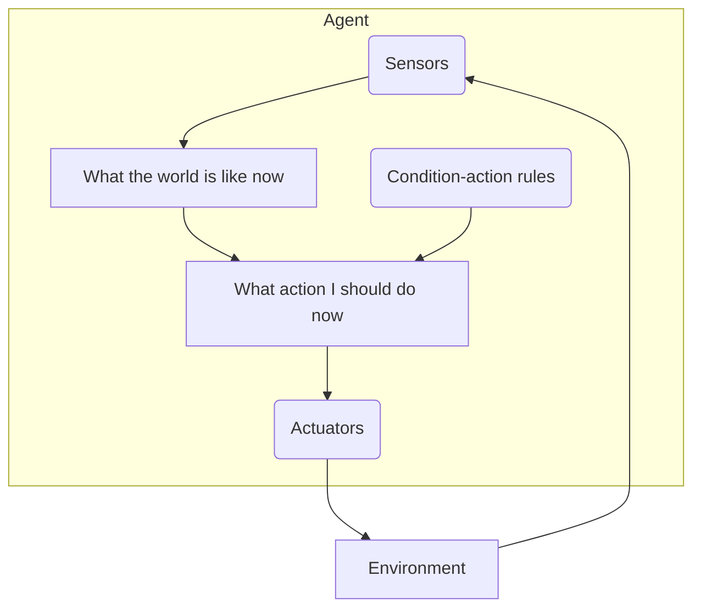

# Agents

## Agent (Imp)

- An agent can be anything that perceive its environment through sensors and act upon that environment through actuators
- An agent runs in the cycle of perceiving, thinking, and acting
- To understand the structure of intelligent agents, we should be familiar with architecture and agent program
- `Agent = Architecture + Agent Program`

### Architecture

Architecture is the machinery that the agent executes on. It is a device with sensors and actuators, for example: a robotic car, a camera, a PC.

### Agent Program

Agent program is the implementation of agent function

### Agent Function

Agent function is a map from the percept sequence to an action

### When is an agent program considered intelligent?

An agent program is an intelligent agent program if it follows the weak notion (i.e., flexibility, interactivity, and autonomy) and strong notion (i.e., information-related states, connotative states and affective states)

## Intelligent Agent (Imp)

- An intelligent agent is an autonomous entity which acts upon an environment using sensors and actuators for achieving goals.
- An intelligent agent may learn from the environment to achieve their goals

## Basic kinds of Agent Programs (Imp)

### Simple Reflex Agent

- The simple reflex agents are the simplest agents
- These agents take decisions on the basis of the current percepts and ignore the rest of the percept history
- These agents only succeed in the fully observable environment
- The simple reflex agent works on condition-action rule, which means it maps the current state to action
- It acts according to a rule whose condition matches the current state, as defined by the percept

### Model-based Reflex Agent

- Can work in a partially observable environment, and track the situation
- It has two important factors
  - **Model:** Knowledge about "how things happen in the world," so it is called model-based agent
  - **Internal State:** It is a representation of the current state based on percept history
- These agents have the model, "which is knowledge of the world" and based on the model they perform actions
- It keeps track of the current state of the world using an internal model and then chooses an action

### Goal-based Agents

- Knowledge of current state environment is not always sufficient to decide for an agent to what to do
- The agent needs to know its goal which describes desirable situations. They choose an action, so that they can achieve the goal
- These agents may have to consider a long sequence of possible actions before deciding whether the goal is achieved or not
- It keeps track of the world state as well as a set of goals it is trying to achieve, and chooses an action that will (eventually) lead to the acheivement of its goals

### Utility-based Agents

- Best way to achieve the goal
- Useful when there are multiple possible alternatives, and an agent has to choose in order to perform the best action
- Utitility function maps each state to a real number to check how efficiently each action achieves the goals
- Uses a model of the world, along with a utility function that measures its preferences among states of the world. Then it chooses the action that leads to the best expected utility, where expected utility

## Characteristics of Intelligent Agent (IA)

The IA must do/have the following:

- Learn & improve through interaction with the environment
- Adapt online & in real time situtation
- Learn quickly from large amounts of data
- Accommodate new problem solving rules incremently
- Memory that exhibits storage & retrieval capacities
- Able to analyse self in terms of behavior, error & success

## Properties of Environments (Imp)

### Discrete / Continuous

If there are a limited number of distinct clearly defined, states of the environment, the environment is discrete otherwise it is continuous

### Observable / Partially Observable

If it is possible to determine the complete state of the environment at each time point from the percepts it is observable; otherwise it is only partially observable

### Dynamic / Static

If the environment is changing for agents action thent he environment is dunamic for htat agent, otherwise it is static

### Single Agent / Multiple Agents

An agent operating by itself in an environmment is single agent. Multiple agent is when other agents are present. Other agent is anything that changes from step to step

### Accessible / Inaccessible

If the agent's sensory apparatus can have access to the complete state of the environment, thent the environment is accessible to that agent; otherwise it is inaccessbile

### Deterministic / Non-deterministic

If the next state of the environment is completely determined by the current state and the actions of the agent, then the environment is deterministic; otherwise it is non-deterministic

### Episodic / Non-episodic

If the agent's experience is divided into atomic episodes and in each episodes the agent receives a percept and then performs a single action, tehnt the environment is episodic; otherwise it is non-episodic

## Learning Agent

- A learning agent is a tool in AI that is capable of learning from its experiences
- They are able to perform tasks, analyse performance and look for new ways to improve on those tasks

### Architecture of Learning Agent

A learning agent can be divided into four components

#### Learning Element

- Responsible for making improvements
- Uses feedback form critic on how the agent is doing and determines how the performance elements should be modified in the future
- The design of leaerning element depeneds on the design of performace element

#### Performance Element

Responsible for selecting external action

#### Critic

- Tells the learning elements how well the agent is doing with respect to a fixed performance standard
- Necessary because the percepts themselves provide no indiciaiton of the agent's success

#### Problem Generator

- Responsible for suggesting actions that will lead to new and informative experiences
- It also suggests exploratory actions

### Characteristics of Learning Agent (Imp)

#### Situatedness

When an agent receives some form of sensory input from its environment, it then performs some acitons that change its environment in some way

#### Autonomy

This agent characteristics means that an agent is able to act without direct intervention from humans or other agents. This type of agent has almost complete control over its own actions and internal state

#### Adaptivity

This agent characteristics means that it is capable of reacting flexibly to changes within its environment. It is able to accept goal directed initiatives when appropriate and is also capable of learning from its own experiences, environment and interaction with others

#### Sociability

This type of characteristic means that the agent is capable of interacting in a peer-to-peer manner with other agents or humans

### Applications of learning agent (Imp)

1. Clustering
2. Classification
3. Prediction
4. Search engines
5. Computer vision
6. Self-driving car
7. Recognition of gestures
